# FindCart — Smart Supermarket Navigation App

FindCart is an Android application that transforms the supermarket 
shopping experience by providing customers with an interactive 
store map showing real-time rack and fridge layouts.

## The problem it solves
Customers waste time searching for products across large 
supermarkets. FindCart eliminates this by showing exactly 
which rack contains which product — instantly.

## Key features
- Interactive store blueprint with racks and fridges layout
- Visual rack highlighting — selected items turn the rack green
- Smart shopping list — select items and see their exact location
- Real-time stock availability status
- Online bill generation
- Online payment and checkout — skip the billing counter queue
- Offers and deals section

## Tech used
- Android Studio
- Java / Kotlin

## Screenshots

  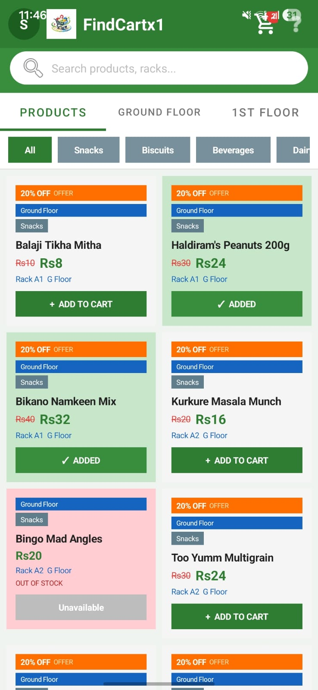
  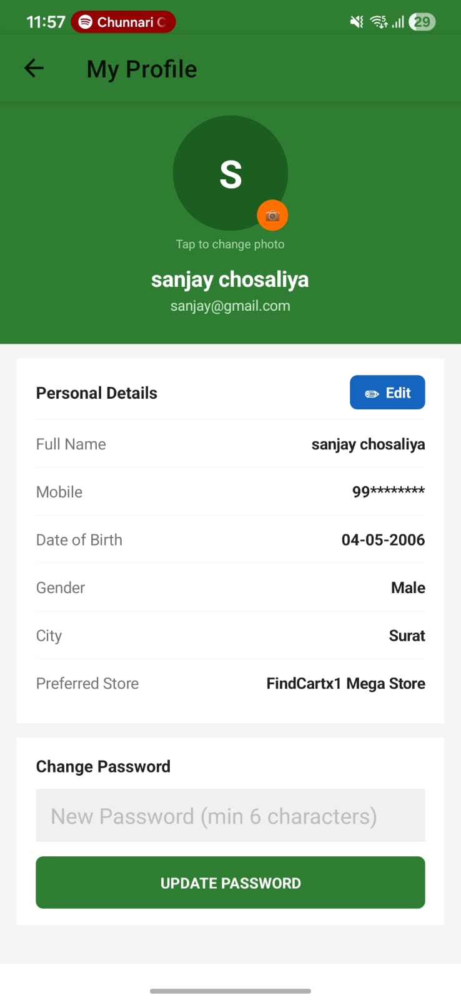
  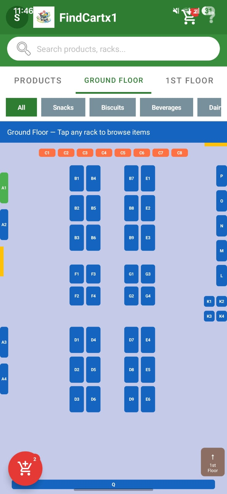
  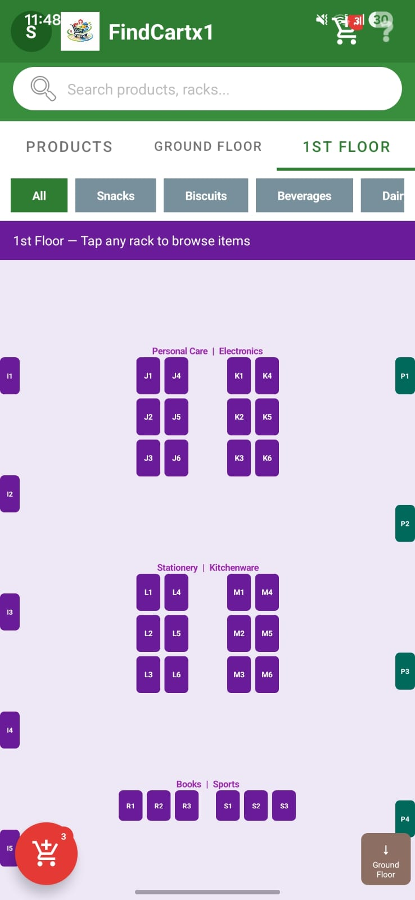
  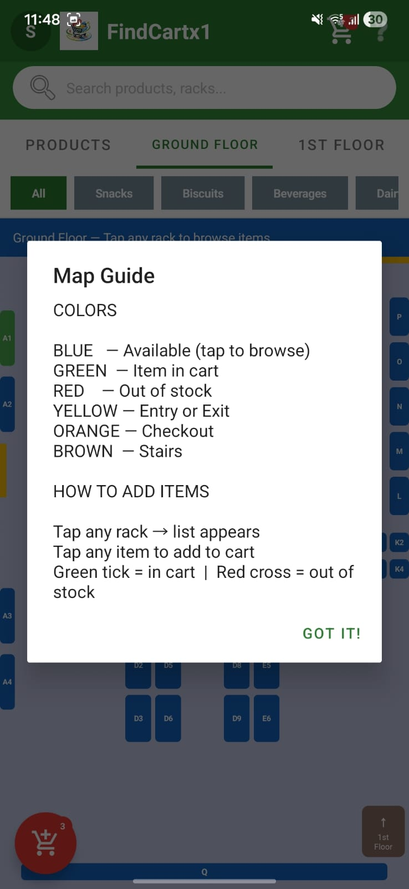
  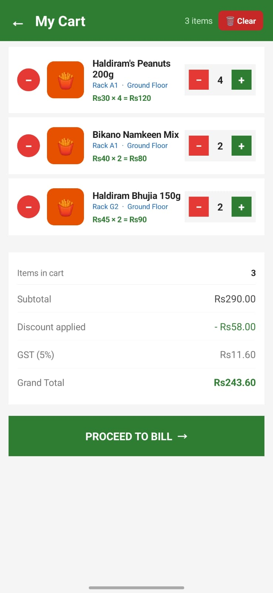
  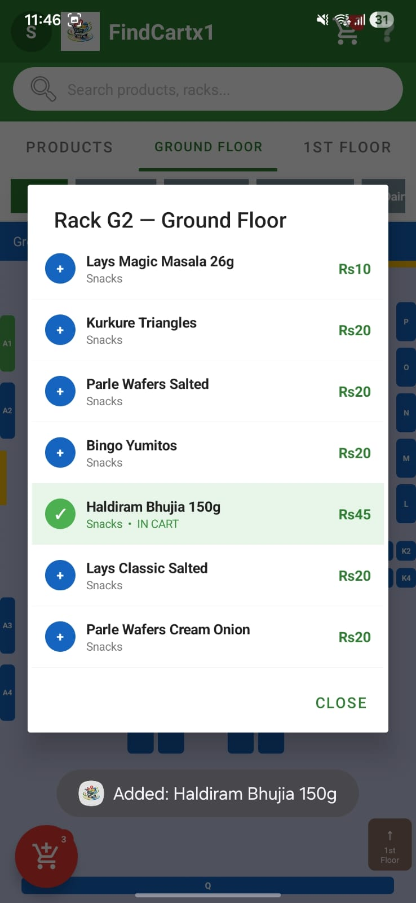
  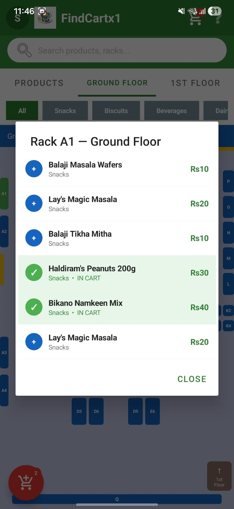
  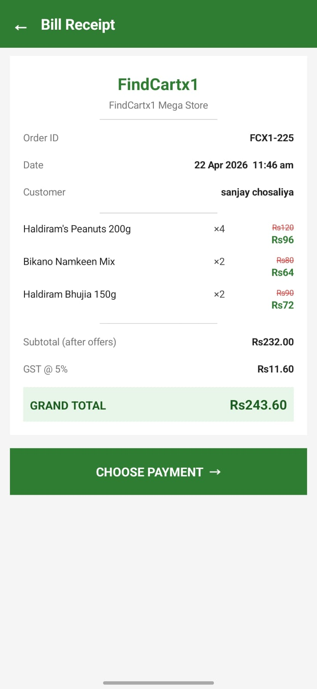
  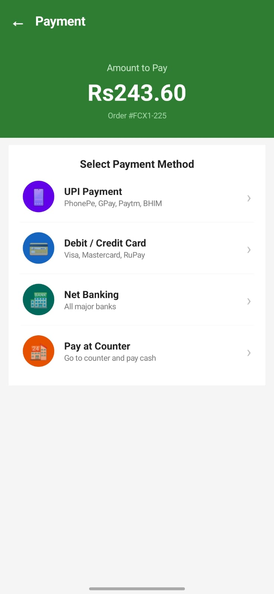
  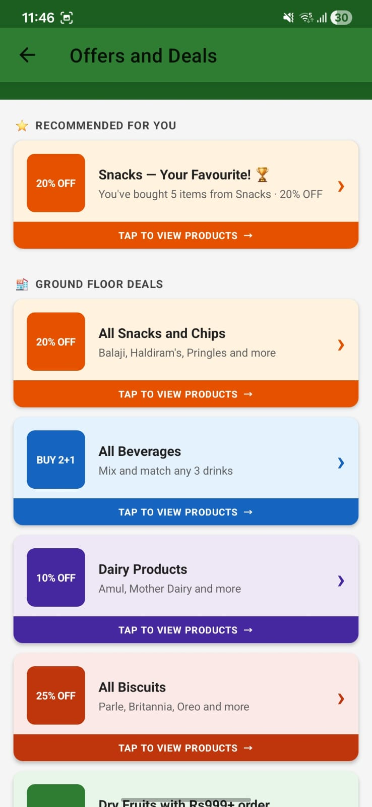
  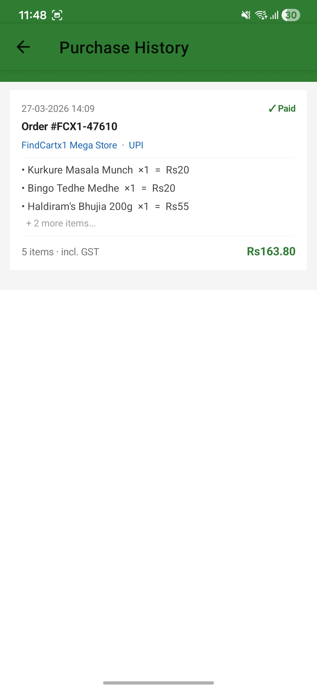

## Status
In Development / Completed
